<picture>
  <source media="(prefers-color-scheme: dark)" srcset="assets/header-dark.svg">
  
</picture>

<p align="center">
  <a href="https://su.acm.org"></a>
  <a href="https://github.com/Mo1Amin/Meqat-Widget/releases"></a>
  
</p>

### `$ whoami`

```yaml
name: Mohamed Amin Abdelwahed
role: Software Engineer (full-stack web and desktop)
studying: Software Engineering, Faculty of Computers & IT, Sinai University
building: ACM Sinai platform · MED-NOTES · Meqat
co_founded: Sinai University ACM Student Chapter
cares_about: [clean UI, security by default, apps that work offline]
```



### ⭐ Featured work

<p>
  <a href="https://su.acm.org"></a>
  <a href="#-med-notes"></a>
  <a href="https://github.com/Mo1Amin/Meqat-Widget"></a>
  <a href="https://mo1amin.github.io/shifa-hospital-website/"></a>
</p>

<details>
<summary><b>What went into the ACM Sinai platform</b></summary>
<br>

- Server-rendered Node.js/Express app with an admin dashboard for tracks, events, gallery albums, team, and a competitions winners board
- Security: Argon2id passwords, TOTP two-step sign-in with recovery codes, account lockout, CSRF tokens, strict Content-Security-Policy, role-based permissions, and a full audit log
- Every upload is decoded and re-encoded to WebP on the server; cookieless analytics with a weekday × hour heatmap
- Interactive three.js particle sphere, scroll-reveal motion and light/dark themes, deployed on cPanel (Passenger) with end-to-end tests in Playwright

</details>

<details id="-med-notes">
<summary><b>MED-NOTES (private, proprietary)</b></summary>
<br>

A study platform for medical students. The code is private; a walkthrough is available on request.

- React + TypeScript front end, Supabase (Postgres, auth, edge functions) back end
- Reading PDFs with handwriting, lasso and shape tools; notes that sync and keep working offline
- A bookstore with manual payment review, packaged for Windows (Electron) and Android (Capacitor)

</details>


### 🧰 Tools I build with

<p align="center">
  <picture>
    <source media="(prefers-color-scheme: dark)" srcset="https://skillicons.dev/icons?i=js%2Cts%2Creact%2Cnodejs%2Cexpress%2Chtml%2Ccss%2Ctailwind%2Cmysql%2Cpostgres%2Csupabase&theme=dark&perline=11">
    
  </picture>
  <br>
  <picture>
    <source media="(prefers-color-scheme: dark)" srcset="https://skillicons.dev/icons?i=rust%2Ctauri%2Celectron%2Cthreejs%2Cvite%2Cgit%2Cgithub%2Cgithubactions%2Clinux%2Cvscode%2Cfigma&theme=dark&perline=11">
    
  </picture>
</p>


### 🐍 Contributions

<picture>
  <source media="(prefers-color-scheme: dark)" srcset="https://raw.githubusercontent.com/Mo1Amin/Mo1Amin/output/snake-dark.svg">
  
</picture>

### 📫 Get in touch

<p>
  <a href="https://su.acm.org"></a>
  <a href="https://www.facebook.com/acm.sinai"></a>
</p>
